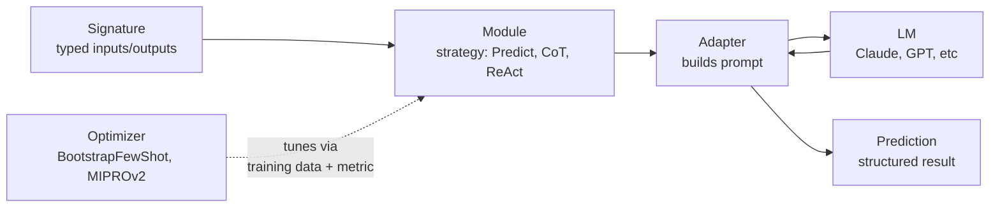
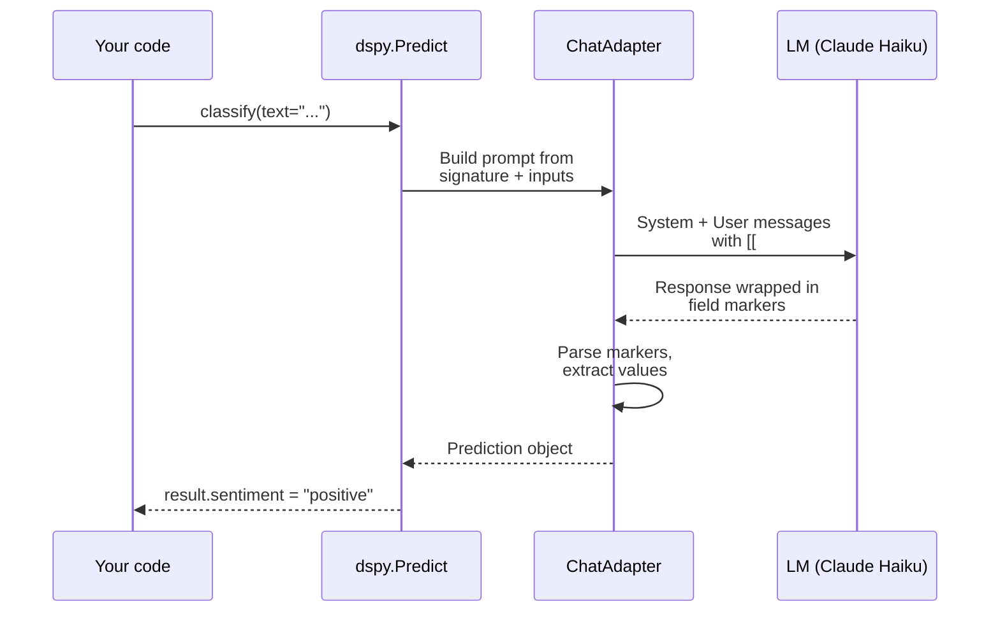
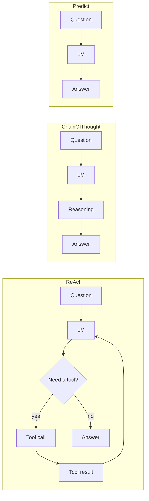
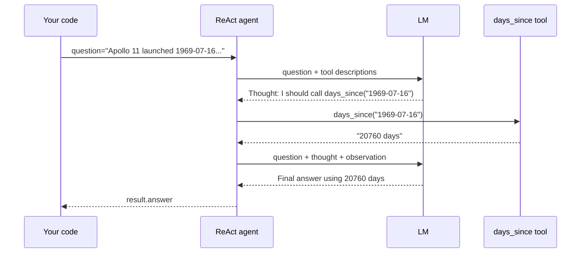
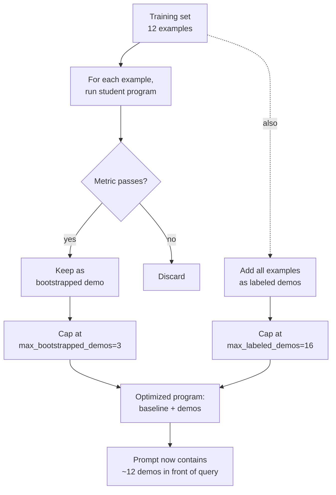
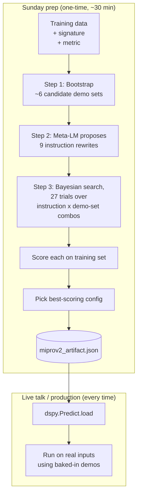

# Cell-by-cell deep dive

For each cell: what's on screen, what it does, how it works under the hood, talking points, and anticipated Q&A grouped by skill level.

---

## Quick concept refresher

Five terms to grok. Master these first.

### Signature
A typed declaration of inputs and outputs. Like a function signature in Python but for an LM. Examples:
- String form: `"text -> sentiment: str"`
- Class form: `class Foo(dspy.Signature): ...` with `dspy.InputField()` and `dspy.OutputField()`

The signature is data, not code. DSPy compiles it into a prompt.

### Module
A *strategy* for executing a signature. Same signature, different module = different behavior. Built-in modules:
- `dspy.Predict` - one-shot question to LM
- `dspy.ChainOfThought` - inject reasoning step before answer
- `dspy.ReAct` - call tools iteratively
- `dspy.ProgramOfThought` - generate and execute Python code as reasoning
- `dspy.BestOfN` - run N times, pick best by metric

### Adapter
The thing that turns your signature + input into the actual prompt sent to the LM. Default is `ChatAdapter` which uses `[[ ## field ## ]]` markers for parsing. You usually don't think about adapters.

### Optimizer (aka teleprompter)
A function that takes a program (signature + module), training examples, and a metric, and returns a *better* program. The "better" version has demos or rewritten instructions baked in. Common ones:
- `BootstrapFewShot` - run program on training data, keep successful traces as demos (greedy, fast)
- `BootstrapFewShotWithRandomSearch` - try multiple random selections of demos, keep the best
- `MIPROv2` - Bayesian optimization over instructions AND demo sets (heavy, accurate)
- `COPRO` - optimize the instruction text only

### Metric
A function `(example, prediction, trace=None) -> bool | float`. DSPy uses metrics during optimization to decide which demos/instructions are "winners".

### The big picture in one diagram



You write the signature and pick the module. DSPy turns them into a prompt, sends to the LM, parses the response back. An optimizer (when used) tunes the module by baking in demos or rewriting instructions, with training data and a metric as the inputs.

---

## Cell 1: Setup

### What's on screen
```python
import os
import logging
from dotenv import load_dotenv

logging.getLogger("LiteLLM").setLevel(logging.ERROR)

import dspy

load_dotenv(override=True)
lm = dspy.LM("anthropic/claude-haiku-4-5-20251001", max_tokens=800)
dspy.configure(lm=lm)
print("Mission Control online.")
```

Output:
```
Mission Control online.
```

### What it does
Loads your Anthropic API key from `.env`, creates an LM client pointing at Claude Haiku 4.5, sets it as the default LM for the whole notebook.

### How it works
- `logging.getLogger("LiteLLM").setLevel(logging.ERROR)` - DSPy uses LiteLLM internally as the multi-provider router. LiteLLM tries to pre-load handlers for AWS Bedrock and SageMaker on import. Without `botocore` installed, those handlers fail to load and LiteLLM emits WARNING messages. Setting the log level to ERROR silences them. 
- `load_dotenv(override=True)` - Reads the `.env` file into `os.environ`. The `override=True` is important: if there's an empty `ANTHROPIC_API_KEY` already in the shell environment, default `load_dotenv()` would NOT replace it (it only fills missing vars). With `override=True`, the `.env` always wins.
- `dspy.LM(...)` - Creates an LM client object. The string `"anthropic/claude-haiku-4-5-20251001"` is in LiteLLM's `provider/model` format. `max_tokens=800` caps response length per call.
- `dspy.configure(lm=lm)` - Sets this LM as the global default. Every subsequent `dspy.Predict(...)` call uses it unless overridden via `dspy.context(lm=other_lm)`.

### Talking points
- "Six lines to wire up Claude. Notice how little Anthropic-specific code there is - I never mention 'anthropic SDK' or 'messages.create' or 'system prompt'. DSPy abstracts all of that. If I swap to OpenAI, the only line that changes is the LM string."
- "The override=True on load_dotenv is a small detail. Without it, if your shell has an empty ANTHROPIC_API_KEY var, your real key from .env gets ignored. Cost me half an hour once."

### Q&A

**Tier 1 (beginners)**

> "What's a .env file?"

A plain-text file with `KEY=value` lines. Standard way to hold secrets out of source code. The `python-dotenv` package reads it into environment variables. Never commit it to git.

> "Do I need an API key?"

Yes. Anthropic at https://console.anthropic.com gives you one. About $5 minimum top-up. Haiku is cheap - a whole demo session is under $1.

> "Why Claude Haiku 4.5 and not Sonnet?"

Cost and speed. Haiku is ~4x cheaper than Sonnet ($0.80/M input vs $3/M) and faster. For this demo, the quality differences barely matter. Cell 9 shows the swap to Sonnet so you can compare.

**Tier 2 (intermediate)**

> "What is LiteLLM?"

A Python library that gives you a unified interface to 100+ LM providers (Anthropic, OpenAI, Google, Cohere, local Ollama, AWS Bedrock, etc.). DSPy uses LiteLLM under the hood. You don't have to think about it.

> "What does max_tokens do?"

Caps the LM's response to 800 tokens. Tokens are roughly 0.75 words on average. 800 tokens = ~600 words = a few paragraphs. If your task needs longer outputs, bump it up.

> "Does dspy.configure affect later cells?"

Yes. The LM is global to the kernel/process. If you restart the kernel, you re-run cell 1.

**Tier 3 (advanced)**

> "What's the difference between dspy.LM and dspy.OpenAI/dspy.Anthropic?"

DSPy 2.x had per-provider classes. DSPy 3.x consolidated to a single `dspy.LM` that takes a LiteLLM provider string. Old classes still work but are deprecated.

> "Can I use my own LM client?"

Yes. Implement the `dspy.LM` interface (basically `__call__(prompt, **kwargs) -> list[str]`). Useful for custom endpoints, local servers, or special routing logic.

> "What about caching?"

DSPy caches LM responses by default. Set `dspy.configure(cache=False)` to disable. Cache lives in `~/.dspy_cache` by default.

---

## Cell 2: Your First Signature

### What's on screen
```python
classify = dspy.Predict("text -> sentiment: str")
result = classify(text="The launch was successful and the crew is in great spirits.")
print(result.sentiment)
```

Output:
```
positive
```

### What it does
Creates the smallest possible DSPy program with a string-form signature. Runs it on one input. Prints the output.

### How it works
- `"text -> sentiment: str"` is parsed by DSPy into:
  - One input field named `text`, type `str` (default when omitted)
  - One output field named `sentiment`, type `str` (explicit)
- `dspy.Predict(sig)` creates a callable module bound to that signature
- Calling `classify(text=...)` triggers:
  1. The adapter (ChatAdapter) builds a system message describing inputs/outputs
  2. Wraps your `text` value in field markers: `[[ ## text ## ]]\n{value}`
  3. Sends to the configured LM
  4. Parses the response back, extracting whatever appears under `[[ ## sentiment ## ]]`
  5. Returns a `Prediction` object with `.sentiment` attribute
- The whole flow is one LM call. No retries, no chain.

### Execution flow



### Talking points
- "Five tokens. Five. That is the entire program. The library does the rest."
- "Notice I never wrote 'classify the sentiment of this text and respond with one word'. The library wrote that from my signature."

### Q&A

**Tier 1**

> "How did it know what 'positive' meant?"

The model's pretraining. The output field is named `sentiment` and the input is text. The LM infers from context that "sentiment" usually takes values like positive/negative/neutral.

> "What if I wanted positive/negative/neutral specifically?"

Use class form with a description: `sentiment: str = dspy.OutputField(desc="One of: positive, negative, neutral")`. You'll see this pattern in cell 4.

**Tier 2**

> "Can I have multiple inputs?"

Yes: `"text, context -> sentiment: str"`.

> "Multiple outputs?"

Yes: `"text -> sentiment: str, confidence: float"`. You'll see this in cell 5.

> "What types are allowed?"

`str`, `int`, `float`, `bool`, `list[str]`, `dict`, plus any Pydantic model class. DSPy uses Pydantic for validation under the hood.

**Tier 3**

> "Where does the system prompt come from?"

The signature is compiled into a system message by the adapter. You can see the result via `dspy.inspect_history` (cell 3). Roughly: "Your input fields are: ... Your output fields are: ... All interactions will be structured ..."

> "What if the LM returns something that doesn't match the schema?"

DSPy's adapter has a retry mechanism. If parsing fails (e.g., field markers missing), it re-prompts up to `max_retries` times. Configurable.

> "Can I customize the adapter?"

Yes. Default is `ChatAdapter`. Alternatives include `JSONAdapter` (returns JSON). `dspy.configure(adapter=JSONAdapter())` switches it.

---

## Cell 3: The Reveal (inspect_history)

### What's on screen
```python
dspy.inspect_history(n=1)
```

Output: roughly 800 chars showing System message + User message + Response, with the actual prompt DSPy sent for cell 2's call.

### What it does
Prints the full prompt and response from the most recent LM call.

### How it works
- DSPy maintains a per-process call history of LM interactions
- `inspect_history(n=K)` prints the last K calls in chronological order
- Output format: System message, User message, Assistant response (color-coded with ANSI escapes that render in Jupyter)
- The "magic" is that the printed prompt shows the field markers, the formatted instructions, and the actual response - all the scaffolding DSPy built from your 5-token signature

### Talking points
- "This is the punchline of the first ten minutes of the talk. Look at this prompt. Twenty something lines. I never wrote any of it. The library built it from my five-token signature."
- "Notice the `[[ ## sentiment ## ]]` markers. That's how DSPy unambiguously parses the LM's response. The model is told the structure and just fills it in."

### Q&A

**Tier 1**

> "What are those `[[ ## ## ]]` things?"

Field markers. DSPy uses them to tell the LM "your response should put the sentiment value between these markers". Then on the way back, DSPy uses the same markers to extract just that value.

**Tier 2**

> "Could I write a better prompt by hand?"

Maybe, for one model. But the moment you swap models, your hand-written prompt may not transfer. DSPy's auto-generated prompts are tuned to be robust across models.

> "Does inspect_history show every call?"

It shows the last N. The full history is stored in the LM object until kernel restart. Use `n=100` if you want the whole session.

**Tier 3**

> "Can I get programmatic access?"

Yes. `dspy.settings.lm.history` is a list of dicts with prompt, response, model, tokens, etc.

> "What overhead does history tracking add?"

Negligible. It's an in-memory list of strings. No I/O.

---

## Cell 4: Class-Form Signatures (MissionReport)

### What's on screen
```python
class MissionReport(dspy.Signature):
    """Classify a mission status update from a flight controller."""
    transmission: str = dspy.InputField()
    severity: str = dspy.OutputField(desc="One of: nominal, advisory, urgent")
    summary: str = dspy.OutputField(desc="One sentence summary")

report = dspy.Predict(MissionReport)
out = report(transmission="Houston, we have a problem. Main bus B undervolt.")
print(f"Severity: {out.severity}")
print(f"Summary: {out.summary}")
```

Output:
```
Severity: urgent
Summary: Main bus B is experiencing undervoltage, indicating a critical power system failure requiring immediate attention.
```

### What it does
Same paradigm as cell 2 but in class form. Adds a docstring (becomes instructions), typed fields with descriptions, multiple outputs.

### How it works
- The class inherits from `dspy.Signature`
- The docstring `"""Classify..."""` becomes the high-level instruction (`objective` in the prompt)
- Each `dspy.InputField()` or `dspy.OutputField()` declares a field
- `desc=...` adds field-level descriptions that the LM sees inline
- DSPy compiles this to a prompt with the docstring as instructions and per-field descriptions inline
- The model returns BOTH `severity` and `summary` in one call (one prompt, structured response)
- Apollo 13 reference ("Houston, we have a problem") triggers `urgent` classification

### Talking points
- "Same paradigm. Typed fields, descriptions, a docstring. It's a class because for production code you want IDE autocomplete, type checking, and a proper place to put per-field docs."
- "Watch: 'Houston, we have a problem' got classified as urgent. The model picked up the Apollo 13 reference."
- "I bury that joke in every demo. I'm sorry. Not sorry."

### Q&A

**Tier 1**

> "Does the order of fields matter?"

Yes for outputs - they're produced in declaration order. DSPy uses this for ChainOfThought to put reasoning before answer fields.

> "Are descriptions required?"

No. The field name alone is often enough. Descriptions help when the model needs to know constraints ("One of: ...") or format hints.

**Tier 2**

> "When should I use string form vs class form?"

String form for quick exploration. Class form for:
- Production code (you'll want IDE support)
- Complex schemas (more than 2-3 fields)
- Per-field descriptions
- Typed fields beyond str

> "Can I subclass signatures?"

Yes, but it's rarely needed. Just compose with modules instead.

**Tier 3**

> "How does Pydantic interact with this?"

DSPy uses Pydantic v2 under the hood for type validation. If you declare `severity: int` and the LM returns "five", DSPy/Pydantic will try to coerce to 5. If coercion fails, retry up to `max_retries`.

> "Can I use custom Pydantic models as field types?"

Yes. `class Address(BaseModel): street: str; city: str` then `address: Address = dspy.OutputField()` works. The LM is instructed to fill in a JSON-shaped object that gets parsed back to your Address class.

> "What's the difference between desc and the docstring?"

Docstring = task-level instruction. Field desc = per-field hint. Both end up in the prompt but at different scopes.

---

## Cell 5: Vibes (the absurd demo)

### What's on screen
```python
vibes = dspy.Predict("vibes -> stock_pick: str, confidence: float")
print(vibes(vibes="kind of a mercury retrograde tuesday energy"))
```

Output (varies):
```
Prediction(
    stock_pick='NVDA',
    confidence=0.23
)
```

### What it does
Demonstrates that DSPy does not validate intent. If you ask for a stock pick from vibes, the model attempts it.

### How it works
- Signature parsed as input `vibes: str`, outputs `stock_pick: str` and `confidence: float`
- The model takes the vibes literally, leans on pretraining biases (NVDA is a frequently-mentioned AI stock), picks a low confidence because "mercury retrograde" sounds mystical
- Type coercion: `confidence: float` causes DSPy to parse the response as a float

### Talking points
- "Signatures do not police your intent. If you ask for a stock pick from vibes, you get a stock pick from vibes."
- "I built that prompt for an entire afternoon at a previous job. It did not pay well."
- "The model gamely tries. This is also a valid DSPy program."

### Q&A

**Tier 1**

> "Does this actually work?"

The model produces an output, yes. Whether it's useful is another question. The confidence is low, which is honest.

**Tier 2**

> "Could I add validation?"

Yes. Use ChainOfThought to make the model reason about whether the inputs are sensible. Or add a separate signature that classifies inputs as "well-formed task" vs "garbage", and route accordingly.

**Tier 3**

> "Is the confidence calibrated?"

No. LM confidence outputs are notoriously poorly calibrated. For real calibration you'd need a different setup: temperature sampling N times, look at agreement, return that as confidence.

---

## Cell 6: Partner Activity (Live demo)

### What's on screen
A pre-baked AttendeeMission example (meeting transcript → action items). On stage you'll replace this with whatever the audience voted for.

```python
class AttendeeMission(dspy.Signature):
    """Extract action items from a meeting transcript."""
    transcript: str = dspy.InputField()
    action_items: str = dspy.OutputField(desc="Newline-separated list of action items")

demo = dspy.Predict(AttendeeMission)
result = demo(transcript="Sarah will draft the proposal by Friday. Mike will review the budget by Wednesday. Everyone needs to update their availability for next week.")
print(result.action_items)
```

Output:
```
Sarah will draft the proposal by Friday
Mike will review the budget by Wednesday
Everyone needs to update their availability for next week
```

### What it does
Acts as a template for the live audience-card moment. Demonstrates that any signature you can describe, you can run.

### How it works
- Same Predict pattern as cells 2 and 4
- The actual swap on stage is mechanical: replace the class definition with whatever the audience card describes, change the demo input value to something matching that signature, run

### Talking points
- During the talk you read both audience cards aloud in the signatures third, hold them
- In the final third, audience votes
- You paste the winning scenario from SPEAKER_SCENARIOS.md or type it live
- See SPEAKER_SCENARIOS.md for ready-to-paste alternatives

---

## Cell 7: Predict vs ChainOfThought (ExplainCode)

### What's on screen
```python
class ExplainCode(dspy.Signature):
    """Explain what this Python code does in plain English."""
    code: str = dspy.InputField()
    explanation: str = dspy.OutputField()

snippet = "def fib(n):\n    return n if n <= 1 else fib(n-1) + fib(n-2)"

print("Predict says:")
print(dspy.Predict(ExplainCode)(code=snippet).explanation)
print("\nChainOfThought says:")
result = dspy.ChainOfThought(ExplainCode)(code=snippet)
print(f"Reasoning: {result.reasoning}\n")
print(f"Explanation: {result.explanation}")
```

Output: ~2000 chars showing Predict's direct explanation, then ChainOfThought's Reasoning (new field!) + Explanation.

### What it does
Compares two modules on the same signature. The same `ExplainCode` signature is used with both `Predict` and `ChainOfThought`. Predict gives a direct answer. ChainOfThought adds a `reasoning` field automatically.

### How it works
- Signature defines `code` input and `explanation` output
- `dspy.Predict(sig)` builds a one-shot prompt asking for `explanation`
- `dspy.ChainOfThought(sig)` modifies the signature internally to prepend a `reasoning` output field
- During execution, the LM must produce reasoning first, then the explanation
- The `reasoning` field is accessible on the returned Prediction even though you never declared it

### Three modules compared



Same signature works in any of the three. The module decides whether to think, call tools, or just answer.

### Talking points
- "Signatures say WHAT. Modules say HOW. Same signature, two modules, two behaviors."
- "Look, a `reasoning` field appeared automatically. I didn't write it. ChainOfThought injected it because that's how chain-of-thought prompting works - reason first, then answer."
- "Change one word in your code. That's composition."

### Q&A

**Tier 1**

> "Why does CoT add a reasoning field?"

Chain-of-thought prompting is a technique where you ask the model to think step by step before answering. CoT implements this by adding an intermediate `reasoning` field that the model fills in first.

**Tier 2**

> "Is ChainOfThought always better than Predict?"

For complex tasks, usually yes - it improves accuracy. For simple tasks, the extra reasoning tokens are wasted cost. For latency-sensitive applications, Predict is faster.

> "How much more does CoT cost?"

Roughly 2-5x more output tokens. If a Predict response is 100 tokens, a CoT response might be 300-500.

> "Can I access just the reasoning?"

Yes: `result.reasoning`. It's a regular output field.

**Tier 3**

> "How does CoT actually inject the reasoning field?"

DSPy modifies the signature on the fly. It clones the signature and prepends a `reasoning: str = OutputField(desc="...")` field before all other output fields. The order matters because output fields are produced in order.

> "Can I customize the reasoning prompt?"

Yes. Subclass or pass a custom `rationale_type` argument. Most users don't.

> "Is there a 'Tree of Thought' module?"

Not built-in in DSPy 3.x. You'd compose it from `BestOfN` and a custom reasoner. The DSPy team has a research roadmap mentioning it.

---

## Cell 7b: ReAct (Tool-calling)

### What's on screen
```python
import datetime

def days_since(date_str: str) -> str:
    """Return how many days have passed since the given ISO 8601 date (YYYY-MM-DD)."""
    past = datetime.date.fromisoformat(date_str)
    return f"{(datetime.date.today() - past).days} days"

class MissionTimer(dspy.Signature):
    """Answer questions involving dates and elapsed time, using the provided tool when needed."""
    question: str = dspy.InputField()
    answer: str = dspy.OutputField()

agent = dspy.ReAct(MissionTimer, tools=[days_since])
result = agent(question="Apollo 11 launched on 1969-07-16. How many days ago was that, and what does that tell us about the gap between Apollo and Artemis?")
print(result.answer)
```

Output (varies, roughly):
```
Apollo 11 launched approximately 20,760 days (or roughly 56.8 years) ago. This substantial gap tells us that there is more than half a century between the Apollo era of lunar exploration and the current Artemis program...
```

### What it does
Demonstrates ReAct - a module that lets the LM call Python functions ("tools") to get information it doesn't have, then incorporate the results into its answer.

### How it works
- `days_since` is a Python function. Its docstring becomes the tool's description that the LM sees.
- `dspy.ReAct(signature, tools=[fn1, fn2, ...])` creates an agent that can call any of the provided tools
- When called, ReAct enters an iteration loop:
  1. LM sees the question + tool descriptions
  2. LM decides whether to call a tool (and which one with what arguments) OR produce the final answer
  3. If tool call: execute the Python function, feed result back to LM
  4. Repeat until LM produces a final answer or hits max_iters (default 5)
- In our example, the LM probably calls `days_since("1969-07-16")`, gets `"20760 days"`, then synthesizes the final answer

### ReAct trajectory for this cell



ReAct loops between the LM and the tool until the LM decides it has enough information to produce the final answer.

### Talking points
- "Now ReAct. Same signature pattern. The difference is I give it tools - Python functions with docstrings."
- "The agent figured out it needed to call the tool. Got back twenty thousand days. Composed an answer connecting Apollo to the Artemis program we just talked about."
- "Predict gives you an answer. ChainOfThought adds reasoning. ReAct adds tool use. Same signature, different module, different capability."

### Q&A

**Tier 1**

> "How does the agent know to use my tool?"

The tool's docstring describes what it does. The LM reads the docstring and decides when calling it would help answer the question.

> "Can I have multiple tools?"

Yes, pass a list: `tools=[fn1, fn2, fn3]`. The agent picks which one(s) to call.

**Tier 2**

> "What if my tool errors?"

ReAct catches exceptions and feeds the error message back to the LM. The LM might retry with different arguments or give up.

> "How many iterations can it do?"

Default is 5. Configurable via `max_iters` parameter when constructing the ReAct module.

> "Is this the same as LangChain agents?"

Conceptually similar. The difference: DSPy's ReAct is built around the signature abstraction, which makes it optimizable. You can run an optimizer over a ReAct agent the same way you run one over a Predict module.

**Tier 3**

> "Can I see the tool calls?"

Yes. `result.trajectory` shows the sequence of (thought, action, observation) tuples. Also visible via `dspy.inspect_history`.

> "Are tools sandboxed?"

No. They run in your Python process. Don't pass user input to dangerous tools (shell, file deletion, network requests to internal APIs without auth).

> "How does the LM 'call' a Python function?"

It outputs a structured tool call in its response, which DSPy parses, executes the Python function, and feeds the return value back as a new message. Same pattern as OpenAI function calling, but managed by DSPy.

> "Can the tool be async?"

Async tool support landed in DSPy 3.x. Use async def tools and `await agent.aforward(...)`.

---

## Cell 8: Code Reviewer (CodeReviewSig)

### What's on screen
```python
class CodeReviewSig(dspy.Signature):
    """Review Python code and return structured findings."""
    code: str = dspy.InputField()
    quality: int = dspy.OutputField(desc="Quality score from 1 to 10")
    issues: str = dspy.OutputField(desc="Newline-separated list of specific issues")
    improved: str = dspy.OutputField(desc="The code rewritten with the issues fixed")

reviewer = dspy.ChainOfThought(CodeReviewSig)

code_to_review = """
def calculate_total(items):
    total = 0
    for item in items:
        total = total + item.price
    return total
"""

result = reviewer(code=code_to_review)
print(f"Quality: {result.quality}/10")
print(f"Issues:\n{result.issues}")
print(f"\nImproved:\n{result.improved}")
```

Output: Quality 5/10, issues list, improved code with docstring + error handling.

### What it does
A real, useful module. A code reviewer that gives a quality score, a list of specific issues, and an improved version - all from one LM call.

### How it works
- Signature has 3 output fields with different types: `quality: int`, `issues: str`, `improved: str`
- ChainOfThought wrapper means the LM reasons first, then produces all three fields in order
- Type coercion: `quality: int` causes DSPy to parse the response as an int (the LM tends to output "5" or "6" anyway)
- Multi-field output: the LM produces ALL three fields in one structured response, parsed by DSPy via field markers

### Talking points
- "Here's a real module. A code reviewer. Quality score, issues list, improved code - all in one call."
- "This would have been 200 lines of prompt engineering. Maybe a Pydantic schema, JSON parsing, retry logic. It's a class with 4 fields and one ChainOfThought wrapper."
- "Now this is composable. I could put this reviewer behind a tool in ReAct. I could optimize it with BootstrapFewShot. I can swap models. Same code."

### Q&A

**Tier 1**

> "How does the model decide the quality score?"

Holistically. We gave no rubric, no examples. The model uses its training - which has seen tons of code reviews - to pick a number.

**Tier 2**

> "How many output fields can I have?"

Practically unlimited within the token budget. I've seen 10+ field signatures work fine.

> "Why ChainOfThought instead of Predict here?"

Code review benefits from reasoning. The model evaluates the code, identifies issues, then writes the improvement. Predict would tend to produce shallower output.

**Tier 3**

> "Can I add an example to anchor the quality score?"

Yes. Add demos via BootstrapFewShot, or via `dspy.Predict(CodeReviewSig, n=N)` with explicit examples. Examples set the calibration.

> "How robust is the int parsing if the model returns 'five'?"

DSPy/Pydantic tries int coercion. "five" -> fails -> retry. The model usually outputs digits when the field is typed as int.

---

## Cell 9: Model Swap (Haiku vs Sonnet)

### What's on screen
```python
sonnet = dspy.LM("anthropic/claude-sonnet-4-6", max_tokens=1000)
with dspy.context(lm=sonnet):
    sonnet_result = reviewer(code=code_to_review)

print("Haiku 4.5 said:")
print(result.improved)
print("\n---\n")
print("Sonnet 4.6 said:")
print(sonnet_result.improved)
```

Output: Side-by-side comparison. Haiku produces a defensive version with try/except. Sonnet produces a cleaner version using `Protocol` typing.

### What it does
Swaps the LM in one line using a context manager. Same module, same signature - just a different model. The output differs noticeably (Sonnet's is more idiomatic).

### How it works
- `dspy.LM(...)` creates a new LM client pointing at Sonnet
- `with dspy.context(lm=sonnet):` enters a context where the default LM is temporarily overridden
- The `reviewer` module (which we built in cell 8) runs with Sonnet inside the block
- After the `with` block ends, the default LM (Haiku) is restored
- `result.improved` (from cell 8, Haiku) and `sonnet_result.improved` (Sonnet) are printed side by side

### Talking points
- "One line. I edit the LM string. The signature does not change. The module does not change."
- "Haiku says one thing. Sonnet says another with notably more polish - Protocol typing, cleaner error handling. I never rewrote any prompts. I changed the LM."
- "That's the point. The library separates the program from the model. You can write your code once and run it on whatever LM is best for the moment."

### Q&A

**Tier 1**

> "What's the cost difference?"

Haiku 4.5: about $0.80 per million input tokens. Sonnet 4.6: about $3 per million. Roughly 4x more expensive. Output tokens are higher too.

> "When should I use Sonnet?"

When the task is hard and Haiku struggles. Most everyday tasks (classification, extraction, simple Q&A) are fine with Haiku.

**Tier 2**

> "Can I mix providers?"

Yes. `dspy.LM("openai/gpt-4o-mini")` works alongside Anthropic models. LiteLLM handles the routing.

> "What about local models?"

`dspy.LM("ollama/llama3.1")` or `dspy.LM("ollama_chat/qwen2.5-coder")` etc. Need Ollama running locally.

**Tier 3**

> "Can I route per-task?"

Yes. Inside a module's forward method, you can dynamically pick the LM based on input. E.g., simple inputs go to Haiku, complex ones to Opus. DSPy supports this pattern via custom modules.

> "What about Opus 4.x?"

`dspy.LM("anthropic/claude-opus-4-x-xxx")` works. More expensive ($15/M input) but stronger for complex reasoning.

---

## Cell 10: Live Optimizer (Baseline + BootstrapFewShot)

### What's on screen

**Part 1** (the setup + baseline):
```python
class ClassifyTransmission(dspy.Signature):
    """Classify a mission transmission by urgency."""
    transmission: str = dspy.InputField()
    urgency: str = dspy.OutputField(desc="One of: routine, attention, urgent")

train = [
    dspy.Example(transmission="...", urgency="routine").with_inputs("transmission"),
    # ... 11 more examples ...
]

def match(ex, pred, trace=None):
    return ex.urgency.strip().lower() == pred.urgency.strip().lower()

test_case = "Houston, the optimizer is taking longer than expected."

baseline = dspy.Predict(ClassifyTransmission)
print("Baseline result:", baseline(transmission=test_case).urgency)
print("\n--- Baseline prompt sent to the LM ---")
dspy.inspect_history(n=1)
```

**Part 2** (the optimizer):
```python
from dspy.teleprompt import BootstrapFewShot

optimizer = BootstrapFewShot(metric=match, max_bootstrapped_demos=3)
optimized = optimizer.compile(student=dspy.Predict(ClassifyTransmission), trainset=train)

print("Optimized result:", optimized(transmission=test_case).urgency)
print("\n--- Optimized prompt sent to the LM ---")
dspy.inspect_history(n=1)
```

Output: "Bootstrapped 3 full traces..." then "Optimized result: attention" then the optimized prompt with 12 demos inside.

### What it does
The hero moment. Defines training data + a metric. Runs the baseline. Then runs BootstrapFewShot which produces a better prompt by trial. Shows both prompts via inspect_history.

### How it works

**Training data**:
- 12 `dspy.Example` objects, each with a `transmission` string and an expected `urgency`
- `.with_inputs("transmission")` tells DSPy which field is the input (the others are expected outputs for metric evaluation)
- 6 clear-cut examples (routine/attention/urgent with obvious words), 6 ambiguous ones (subtle severity cues)

**The metric**:
- `match(example, pred, trace=None) -> bool`
- Returns True if predicted urgency matches expected urgency (case-insensitive)
- The `trace=None` parameter is reserved for optimizers that want to inspect intermediate reasoning

**Baseline**:
- `dspy.Predict(ClassifyTransmission)` - vanilla, no optimization
- Called on the test case, returns `attention`
- `inspect_history(n=1)` shows the bare prompt with just the signature, no demos

**BootstrapFewShot**:
- `max_bootstrapped_demos=3` caps the number of teacher-generated demos
- `.compile(student=..., trainset=...)`:
  1. Run the student program on each training example
  2. For each, check if the prediction satisfies the metric (matches expected)
  3. Keep up to 3 "successful traces" as bootstrapped demos
  4. Also add training examples as raw labeled demos (default max_labeled_demos=16, so all 12 here)
  5. Build a new program (same signature, same module) with these demos baked in
- The `optimized` program is identical to `baseline` except it has demos attached
- Calling `optimized(transmission=...)` uses those demos as few-shot examples in the prompt

**Why 12 demos in the optimized prompt**:
- Total demos = labeled demos (raw training examples) + bootstrapped demos (teacher traces)
- With 12 training examples and `max_labeled_demos=16`, all 12 raw examples are used as labeled demos
- Plus up to 3 bootstrapped demos - DSPy may dedupe overlap, but in this run we see 12 visible demos

**Same answer**:
- Baseline: `attention`
- Optimized: `attention`
- The baseline was already correct on this easy test case. The IMPROVEMENT is in the prompt - now the model has 12 examples to reference, which helps on harder cases not shown.

### BootstrapFewShot flow



The optimizer just produces a NEW prompt-construction strategy. Same signature, same module, more demos.

### Talking points
- "Here is where it gets fun. You already wrote the signature. You already have your data. DSPy can tune the prompt for you automatically."
- "Define the task. Twelve training examples. A metric that checks if the prediction matches expected. Run the baseline first - look at the prompt, it's bare."
- "Now optimize. BootstrapFewShot is running my program on each training example, keeping the wins, packing them as demonstrations into a new version of the prompt."
- "Look at this. Twelve demonstrations are now in the prompt. Three of them DSPy generated by running my program. The other nine are raw training examples it packed in as labeled demos. I never wrote any of this prompt scaffolding."
- "The library wrote a better prompt than I would have."

### Q&A

**Tier 1**

> "What's a metric?"

A function that scores whether an output is good. In our case, did the predicted urgency match the expected urgency? True or False.

> "What if I don't have labeled training data?"

You'd need to write a programmatic metric instead. Like "does the output contain at least 3 sentences" or "does it pass a regex check". Optimizers work with any callable metric.

> "Why didn't the answer change after optimization?"

Because the baseline already got it right. The improvement is in the PROMPT, which now has demonstrations baked in. On harder examples not shown, the optimized version would beat baseline.

**Tier 2**

> "What's the difference between bootstrapped demos and labeled demos?"

- **Labeled** = raw training examples added to the prompt as-is. `User: transmission X / Assistant: urgency Y`. No reasoning, just input-output pairs.
- **Bootstrapped** = the model ran the task, succeeded, and that full trace (including any reasoning fields if using CoT) becomes a demo. For Predict modules, bootstrapped and labeled look similar because there's no intermediate reasoning to preserve.

> "Why does max_bootstrapped_demos=3 not give me only 3 demos total?"

Because BootstrapFewShot also adds labeled demos by default. To get only 3 total: `BootstrapFewShot(metric=..., max_bootstrapped_demos=3, max_labeled_demos=0)`.

> "What does the 'metric' parameter actually do in BootstrapFewShot?"

It filters bootstrapped traces. After running the student on each training example, only traces where `metric(example, prediction)` returns True (or > 0 for float metrics) are kept as demos.

**Tier 3**

> "What if my training set is huge?"

BootstrapFewShot will iterate through all examples but only keep `max_bootstrapped_demos` winners. The student is called once per training example, so cost scales linearly with trainset size.

> "Can the student and teacher be different?"

Yes. `BootstrapFewShot(metric=..., teacher_settings={'lm': bigger_model})` uses a different LM to generate the demos. Useful when you want a strong teacher to bootstrap demos for a smaller student.

> "What's the rationale for adding labeled demos by default?"

For tasks where the bootstrapped demos may be too few or of low quality, labeled examples provide a fallback set of clean input-output pairs. The combination tends to work better than either alone.

> "Are demos stored in the program object?"

Yes. After compile, the optimized program has a `demos` attribute (list of Example objects). When you call the program, the adapter formats those demos into the prompt before the actual query.

---

## Cell 11: MIPROv2 Load (the heavy optimizer)

### What's on screen
```python
import os

if not os.path.exists("miprov2_artifact.json"):
    print("ERROR: miprov2_artifact.json not found.")
    print("Run the Sunday prep cell below to generate it before the talk.")
else:
    sophisticated = dspy.Predict(ClassifyTransmission)
    sophisticated.load("miprov2_artifact.json")

    test_cases = [
        "Houston, the optimizer is taking longer than expected.",
        "Crew reports unusual noise from the hydroponics module.",
        "All systems green, scheduled meal break commencing.",
    ]

    for t in test_cases:
        result = sophisticated(transmission=t)
        print(f"[{result.urgency:>9}]  {t}")

    print("\n--- The prompt the heavier optimizer produced ---")
    dspy.inspect_history(n=1)
```

Output:
```
[attention]  Houston, the optimizer is taking longer than expected.
[attention]  Crew reports unusual noise from the hydroponics module.
[  routine]  All systems green, scheduled meal break commencing.

--- The prompt the heavier optimizer produced ---
[prompt with 3 surgical demos, one per urgency class]
```

### What it does
Loads a pre-baked MIPROv2 artifact (produced by `scripts/run_miprov2.py` ahead of time), runs it on 3 test cases, and inspects the prompt to show MIPROv2 selected only 3 surgical demos.

### How it works

**Loading the artifact**:
- `dspy.Predict(ClassifyTransmission)` creates a fresh empty Predict module
- `.load("miprov2_artifact.json")` populates it from disk with:
  - The signature (which we already have, but loading verifies match)
  - The demos that MIPROv2 selected
  - Any instruction overrides MIPROv2 chose (in our case, kept original)
  - Metadata

**Running on test cases**:
- 3 deliberately varied test cases
- For each, the model uses the 3 surgical demos as few-shot examples in the prompt
- Outputs all reasonable: meta-joke about delays = attention, unusual noise = attention, all systems green = routine

**Inspecting the prompt**:
- The prompt now has 3 User+Assistant demo pairs (one per urgency class)
- Compared to cell 10's BootstrapFewShot output (12 demos), this is dramatically smaller
- Original instruction text retained (MIPROv2 found rewrites didn't improve over the original)

### Why MIPROv2 ended up with this

MIPROv2 ran 27 trials of Bayesian search:
1. Step 1: Bootstrap a pool of candidate demos (similar to BootstrapFewShot)
2. Step 2: Use a meta-LM to propose 9 candidate instruction rewrites
3. Step 3: Bayesian search over (instruction, demo set) combinations
4. Returns the best-scoring configuration

In our run, MIPROv2 found that:
- Original instruction + Few-Shot Set 0 (3 demos: one routine, one attention, one urgent) scored 100% on the train set
- It tried elaborate rewritten instructions (multi-paragraph aerospace-themed) but they didn't improve over 100%
- Picked the simplest sufficient configuration - parsimony

### MIPROv2 pipeline and production pattern



The expensive search happens once, ahead of time. The saved JSON is the deployable artifact. Cell 11 demonstrates the second half: load the artifact, run it. No re-optimization needed.

### Talking points
- "MIPROv2 is a more sophisticated optimizer. It uses Bayesian optimization over instruction proposals AND demonstration sets. It takes 30 to 45 minutes to compile, so I ran it previously."
- "Three test cases. All classify correctly."
- "Look at this prompt. The demonstrations are different from what BootstrapFewShot picked. BootstrapFewShot grabbed all twelve training examples and stuffed them in. MIPROv2 ran twenty seven trials, considered nine rewritten instructions and many demo combinations, then picked the simplest configuration that still scored one hundred percent: the original instruction plus three surgical demos, one from each urgency category."
- "That is parsimony. Sometimes the smart move is to keep the instructions you have and curate the examples carefully."

### Q&A

**Tier 1**

> "Why pre-compile and load instead of running live?"

MIPROv2 takes 30-45 minutes with auto='heavy'. That doesn't fit in a 45-minute talk. The production pattern is: optimize once, save as JSON, deploy. Cell 11 demonstrates the load-and-deploy step.

> "Is this finetuning?"

No. The model weights don't change. Only the PROMPT changes (different demos and possibly different instructions baked in). This is "prompt optimization" or "program optimization".

**Tier 2**

> "How does MIPROv2 differ from BootstrapFewShot?"

- BootstrapFewShot: greedy, single-pass, deterministic. Just keeps winning demos.
- BootstrapFewShotWithRandomSearch: tries multiple random subsets, picks best by metric.
- MIPROv2: Bayesian search across (instruction text, demo set) combinations. Can rewrite instructions, not just pick demos.

> "What does Bayesian optimization actually do?"

It builds a probabilistic model of "instruction + demo set -> metric score" and uses that model to decide which combinations to try next. Faster convergence than grid search.

> "What's in the saved JSON?"

The demos list (list of Example dicts), the signature (instructions + field definitions), and metadata about which dspy version produced it. Plain JSON, human-readable.

**Tier 3**

> "Can I optimize an instruction-only module?"

Yes. `COPRO` optimizes the instruction text only, not demos. Useful when you have very strong examples already and want to refine the natural-language guidance.

> "What's `auto='heavy'` vs 'light' vs 'medium'?"

Convenience presets for trial counts. `light` = 10 trials, `medium` = 25, `heavy` = 50. Specific to MIPROv2.

> "How is the meta-LM used?"

In Step 2 of MIPROv2, a separate LM call generates candidate instruction rewrites. By default this uses the same LM as your program (Haiku in our case). You can specify a different one for instruction proposal.

> "Does MIPROv2 support multi-stage programs?"

Yes. Optimizers in DSPy operate on `dspy.Module` subclasses, which can be arbitrary computation graphs. You define a module with multiple Predicts/ChainOfThoughts/ReActs and the optimizer tunes all of them.

> "What if my metric is non-deterministic?"

MIPROv2 evaluates on a validation set. Non-determinism (e.g., LM-judge metric with sampling) introduces noise. Strategies: average multiple evaluations, use a deterministic metric, or accept noise.

---

## Cell 12 (Sunday-prep, skipped)

### What's on screen
A try/except block that runs MIPROv2 with BootstrapFewShotWithRandomSearch as fallback, saves to `miprov2_artifact.json`.

### What it does
Produces the artifact loaded by cell 11. Not run during the talk - it takes 30-45 minutes for MIPROv2 (or 5-10 for the fallback BSRS). Tagged with `skip-execution` metadata so `execute_notebook.py` skips it.

### How it works
- Same `match` metric and training data as cell 10
- Try MIPROv2 first (`auto="heavy"` in the actual script, or "light" in the notebook's pre-baked cell)
- If MIPROv2 raises an exception (e.g., missing `optuna` dependency), fall back to BootstrapFewShotWithRandomSearch
- Save the resulting program to disk via `.save(...)`
- Cell 11 loads this artifact during the talk

### Q&A

> "Why might MIPROv2 error?"

Most commonly: missing optional `optuna` dependency. Fix: `pip install optuna`.

> "Can I rerun it?"

Yes. Just execute the cell or `python scripts/run_miprov2.py`. Will overwrite `miprov2_artifact.json`.

> "Does the artifact include API keys or secrets?"

No. Only the optimized program structure (demos, signature, instructions). Safe to commit to git (we do).

---

## Cross-cutting concepts: questions that span multiple cells

### "Is this finetuning?"

No. DSPy doesn't modify model weights. It modifies the PROMPT - what gets sent to the model on each call. The model itself is unchanged.

### "Could I do this with raw OpenAI/Anthropic SDK?"

Yes, but you'd hand-write:
- Prompt templates
- Output parsing
- Retry logic
- Multi-step orchestration
- Optimization (this is the hardest - DSPy's BootstrapFewShot is ~100 lines of careful code under the hood)

DSPy abstracts those.

### "How is this different from LangChain / LlamaIndex / pydantic-ai?"

- **LangChain** / **LlamaIndex**: about wiring components together (retrievers, agents, chains). DSPy is about making the components themselves better via optimization.
- **pydantic-ai**: similar typed signature concept, no built-in optimization story.
- **DSPy**: signature/module/optimizer trio. Optimizable end-to-end. Can coexist with LangChain (use a DSPy module as a LangChain Runnable).

### "How big does the training set need to be?"

- BootstrapFewShot: 5-20 examples is enough.
- MIPROv2: works better with 20-200 examples. Smaller sets converge fast (often to baseline).
- Always need a metric, but the metric can be programmatic (no labeled outputs needed).

### "What about RAG?"

DSPy has `dspy.Retrieve` and `dspy.ChainOfThought` patterns for RAG. Most production systems combine signatures + retrievers + ChainOfThought. Out of scope for tonight but covered in DSPy docs.

### "Is this production-ready?"

- DSPy 3.x is in active development but production-deployed at scale (some companies use it for thousands of LM calls/day).
- Pin to a specific DSPy version (3.2.1 in this repo).
- Cache artifacts and version them (the JSON files).
- Monitor LM costs.

### "What about evaluation?"

DSPy has `dspy.Evaluate` - takes a program, a metric, and a test set, returns aggregate scores. Use it for "did my optimization actually help?" measurements.

### "How does caching work?"

DSPy caches LM responses by default. Same prompt + same model = no second LM call. Cache lives in `~/.dspy_cache`. Disable: `dspy.configure(cache=False)`. Useful in development; turn off when measuring real-world latency.

---

## Likely audience questions about THIS talk specifically

> "Why Mission Control as a theme?"

It's tied to the recent Artemis II splashdown (April 2026), Houston location (PyHou is Houston Python meetup), and gives a clear narrative arc - "you are Mission Control for this mission".

> "Did you build this whole talk in DSPy?"

No, the talk is humans-only. The demos use DSPy live. The audience cards became real signatures we run live in the final third.

> "Where can I get the notebook?"

`github.com/ahliana/dspy_mission_control` - in the slides and notebook.

> "Can I run this without an API key?"

The setup and signature stuff (cells 1-6) won't work without an LM. But you can read the code and the saved outputs on GitHub for free - the notebook is committed with all outputs from a real run.

---

## Talking points you can drop at any moment

- "I never wrote a prompt. The library wrote it for me, from my signature."
- "Signatures say WHAT. Modules say HOW. Optimizers make them better."
- "I edit signatures. I never edit prompts."
- "Five tokens. The whole program."
- "You bring the examples and the metric. DSPy does the prompt engineering."
- "Houston, we have a [whatever]. (Apollo 13 callback)"
- "The library decided the simplest sufficient prompt is the best one."

## If you get a question you don't know

"Honest answer, I don't know off the top. Here's how I'd find out: [check dspy docs / look at source / try it]. Anyone in the room have experience?"

That's a Mission Control move. Pass the comms to someone who knows.
